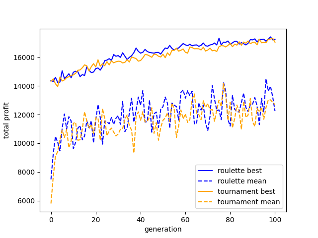
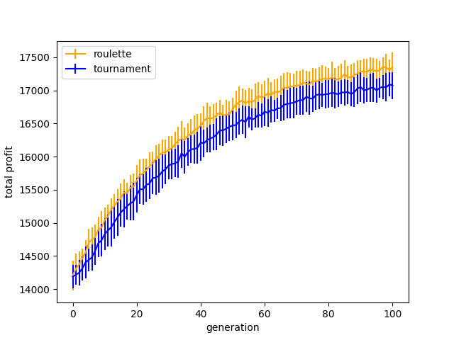

# Evolutionary AI Homework 1
## Components
Dataset Parsing
* knapsack.py

Chromosome class
* individual.py

Error generated to prohibit malfunction
* simpleError.py

Genetic operators (selection, crossover, mutation)
* geneticAlgorithm.py

Generate mean and standard deviation
* statistics.py

Main flow
* simpleGA.py

* * *

## Usage

### Test
    python simpleGA.py [options]

    optional argment:
        -cprob, --crossoverProbability      Set the probability of crossover operator.
        -mprob, --mutationProbability       Set the probability of mutation operator.
        -psize, --populationSize            Set the size of population.
        -gen, --generation                  Set the maximum generation.
        -in, --input                        Set the input filename.
        -out, --output                      Set the output filename(json).

All arguments have default values:
* crossover probability = 0.9
* mutation probability = 0.01
* population size = 100
* generation = 100
* input filename = 'TestData(0-1Knapsack).txt'
* output filename = 'result.json'

### Analysis
    python statistics.py [option]

    optional argument:
        -in, --input                        Set the input filename.
        -out, --output                      Set the output filename.

## Results

These tests processed 30 times.

The result of each test is in `result/` directory.

Example:

`total_result.png` show means and standard deviations by generations.

Result :

* * *

## Supplements

### ipynb files
* simpleGA.ipynb
* statistics.ipynb

For convenience, ipynb file provide instance of results.

These files not save the config and json file.

If you need to test without log, use these.

### json file

If you enter same output filename on testing, result of test is saved same json file.

This stacked results can be reformated by using statistics.py